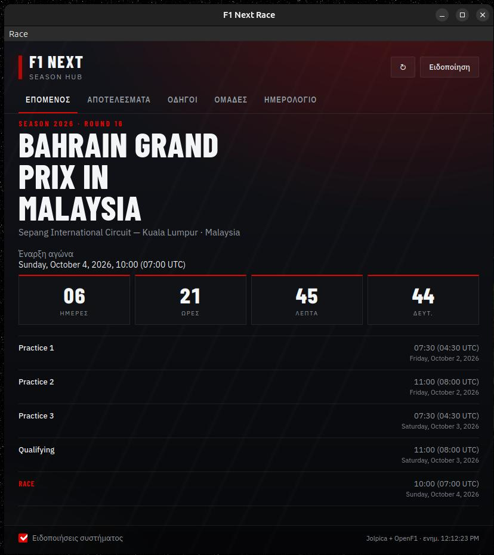
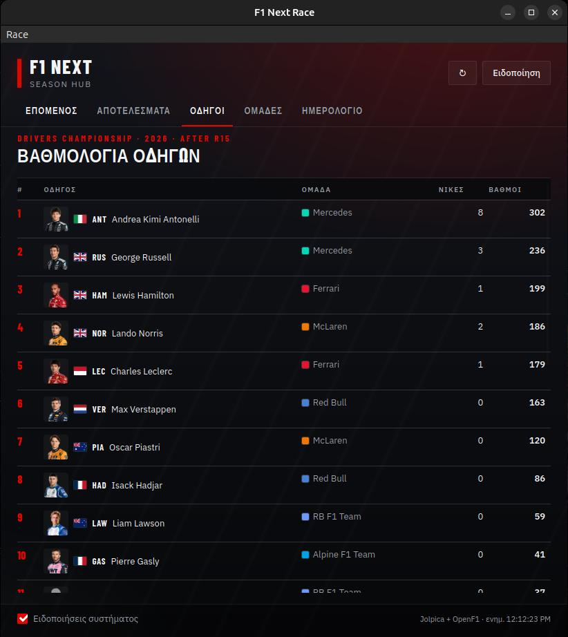
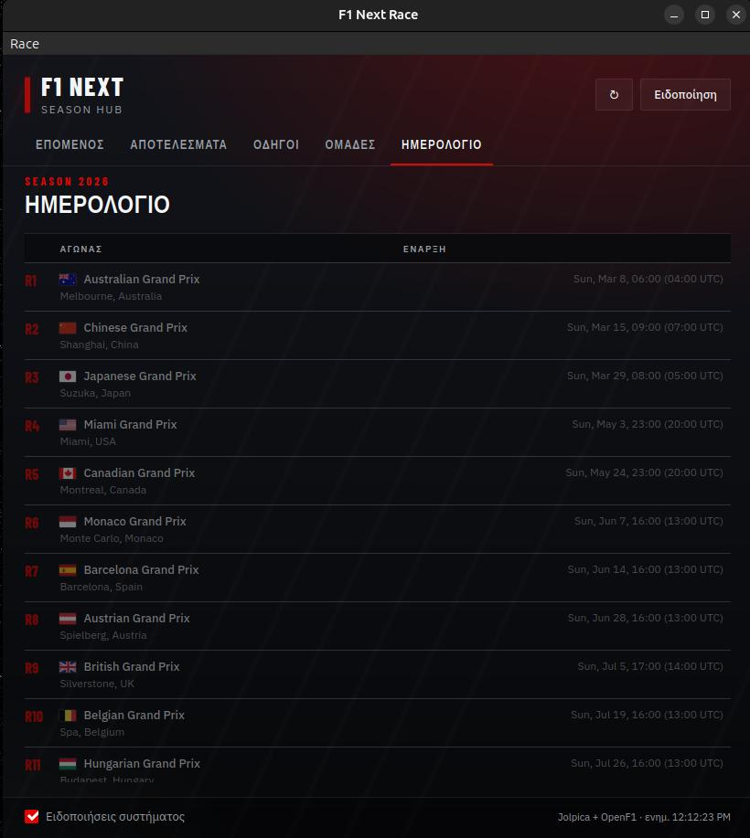

# F1 Next Race

[English](README.md) · [Ελληνικά](README-EL.md)

Μικρή desktop εφαρμογή [tinyjs](https://tinyjs.app/) για **Linux** και **Windows** που δείχνει τον επόμενο αγώνα Formula 1 και σε ειδοποιεί με native notifications του συστήματος.

## Στιγμιότυπα

| Επόμενος αγώνας | Βαθμολογία οδηγών | Ημερολόγιο |
| --- | --- | --- |
|  |  |  |

## Τι κάνει

- Request στο [Jolpica F1 API](https://api.jolpi.ca/ergast/f1/current/next.json) (διάδοχος του Ergast)
- Tabs: επόμενος αγώνας, αποτελέσματα, βαθμολογία οδηγών/ομάδων, ημερολόγιο
- Εμφανίζει αγώνα, πίστα, χώρα και countdown (τοπική ώρα + UTC, με ονόματα ημερών από τα regionals)
- Πρόγραμμα weekend (FP / Qualifying / Race)
- Ειδοποιήσεις: στην πρώτη εμφάνιση του αγώνα, **24 ώρες** πριν, **1 ώρα** πριν, και στην εκκίνηση
- Tray icon ώστε να μένει στο background (κλείσιμο παραθύρου = hide, όχι quit)

## Απαιτήσεις

### Linux

```bash
# runtime tinyjs
curl -fsSL https://tinyjs.app/install | sh

# WebKitGTK (χρειάζεται για το παράθυρο)
sudo apt install libwebkit2gtk-4.1-0
```

### Windows 10/11

```powershell
irm https://tinyjs.app/install.ps1 | iex
```

Χρειάζεται WebView2 (προεγκατεστημένο στα Windows 11).

## Εκτέλεση

```bash
cd f1-next
tinyjs dev      # ανάπτυξη με hot reload
tinyjs build    # πακέτο σε dist/ (στο ίδιο OS που κάνεις build)
```

> Το `tinyjs build` παράγει binary για το host OS. Για Windows build χρειάζεσαι Windows· για Linux, Linux.

## API

Πηγή δεδομένων: `https://api.jolpi.ca/ergast/f1/current/next.json`

Δεν χρειάζεται API key.
